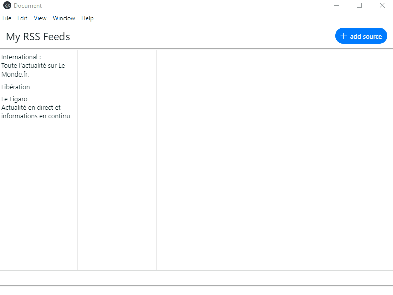

# RSS Reader

Electron + React + Typescript + Recoil

This application is a very basic RSS reader made just for me to learn and practise.... however, at the end it should produce a usable application. Let's see !

## Features
- add/remove/rename RSS feed
- display article images
- link to complete article opens in default browser
- 3 resizable columns layout

## Overview



## npm scripts

### developpement

- starts electron and loads the React app build in *developpement* mode from the webpack server (at http:///localhost:9090) into the renderer process
``` 
npm start
```

- starts the webpack server to serve the React app built in *developpement* mode into a browser (at http://localhost:9090)
``` 
npm run react:serve
```

To Run the React app in a web browser only at http://localhost:9000 :
``` 
npm run react:serve:web
```


### production
- build the Electron *main* and *renderer* process in *production* mode into the `./dist` folder
``` 
npm run build
```
- once the complete app is built (using `npm run build`), package the Electron app for Windows platform with :
``` 
npm run package:win
```
The output is created in folder `./out` and the application can be tested by running `./out/win-unpacked/my-app.exe`

## Links
from :
- https://dev.to/franamorim/tutorial-reminder-widget-with-electron-react-1hj9
- https://github.com/Devtography/electron-react-typescript-webpack-boilerplate
